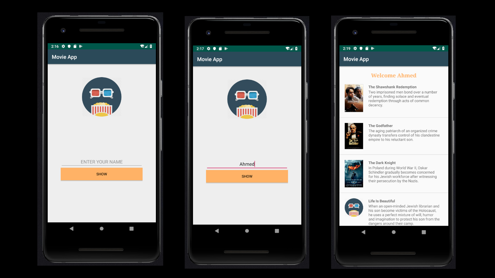

## Tutorial created: Project 3
# Movie-App
#### Used API 29: Android 10 (Q)

## Screenshots

Focused on:
- Passing data via Explicit Intent
- Recycler View using Adapter

## License & Copyrights
Licensed under the [MIT License](LICENSE).
